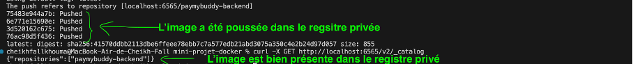

Conteneurisation des micro services backend Spring Boot et la bdd MySQL.

Après un docker images on a bien l’image créée.

Après un docker-compose up -d

Après un docker ps

On voit que les micro-services tournent.

Quand on regarde les logs du container on voit que le service a bien démarré.

On teste le conteneur via un navigateur c’est ok.

J’ai créé un profil avec les coordonnées suivantes :
m.dubois@test.fr
Marianne

Je viens de créer un nouveau profil.

Ceci valide la première partie conteneurisation et test des micro services.

Registre Docker :
Création d’un registre privé : 
J’ai créé un registre privé nommé registry qui tourne sur localhost:6565.

Création des images backend et MySQL :
-Backend :

Pousse de l’image dans le registre privé :

-MySQL
Avec un docker tag mysql:8.0 localhsot:6565/mysql, on taggue l’image pour le registre privé.

Quand on consulte le registre privé on voit qu’on a bien les deux images présentes.

Après avoir mis en place un registre privé avec les deux images paymybuddy-backend et mysql, on va les utiliser dans notre docker-compose pour builder et déployer l’application.

Si on regarde les logs des conteneurs paymybuddy-backend et mysql, on voit que tout est ok.

Après test sur le navigateur le build et le déploiement sont ok.

